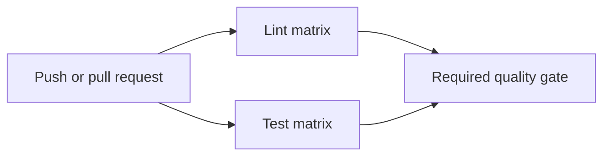

# CI Quality Gate Workflow Specification

## 1. Purpose

Define the automated quality gate for changes to Private Search. The workflow
must detect source errors, lint violations, and test regressions before changes
are merged into `main`.

## 2. Scope

This specification covers validation of Python source, tests, project metadata,
and the two repository-level launcher scripts. It does not cover deployment,
media downloads, external site availability, or production monitoring.

## 3. Trigger and concurrency policy

The workflow runs for pushes to `main` and pull requests targeting `main`.
Only the latest run for a given workflow/ref pair should continue when a newer
run is queued; obsolete runs may be cancelled.

## 4. Validation jobs

### 4.1 Lint and source validation

Run independently on Python 3.12, 3.13, and 3.14. Each execution must:

1. Check out the repository.
2. Provision the matrix Python version with dependency caching.
3. Install the project and development dependencies.
4. Run the configured linter.
5. Compile application and test sources to detect syntax errors.

### 4.2 Test validation

Run independently on Python 3.12, 3.13, and 3.14. Each execution must:

1. Check out the repository.
2. Provision the matrix Python version with dependency caching.
3. Install the project and development dependencies.
4. Run the complete automated test suite.

## 5. Quality gates

Every matrix execution must succeed. A pull request is not considered validated
if any supported Python version fails linting, compilation, or tests.

## 6. Security requirements

- The workflow requests read-only repository contents permission.
- Third-party actions must use explicit major-version references and should be
  reviewed before upgrades.
- Secrets are not required by the CI workflow.
- Runtime downloads, cookies, credentials, and cache databases must not be
  uploaded as artifacts.

## 7. Performance and reliability

- Dependency caching should be enabled for repeat runs.
- Matrix failures should be reported independently so compatibility regressions
  are diagnosable.
- Pull-request runs should cancel superseded work to reduce queue time.
- Tests must remain deterministic and must not depend on live adult-site pages.

## 8. Outputs and diagnostics

The workflow exposes pass/fail status for each lint and test matrix execution.
Failure logs must identify the Python version and the failing validation stage.
No media or runtime cache is produced as a CI artifact.

## 9. Change management

Changes to supported Python versions, quality gates, permissions, triggers, or
artifact handling require an update to this specification and a corresponding
review of the workflow implementation.

## 10. Verification checklist

- [ ] Push and pull-request triggers target the intended branch.
- [ ] All supported Python versions are represented in both matrices.
- [ ] Dependency caching is enabled.
- [ ] Lint, compilation, and tests run from a clean checkout.
- [ ] Repository permissions remain read-only.
- [ ] Runtime data is excluded from workflow outputs.
